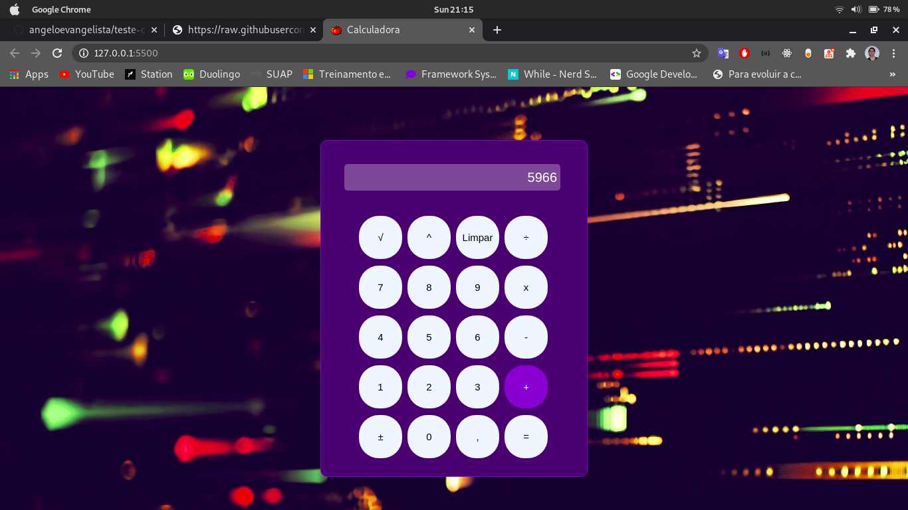

# Calculadora html

<h3 align="center">
  Calculadora feita com html, css e javascript. Usada para treinar os conceitos aprendidos na disciplina Desenvolvimento Web.
</h3>

 

## Como executar

Para executar este projeto basta abrir o arquivo *index.html*

## Resultado

    </img>

